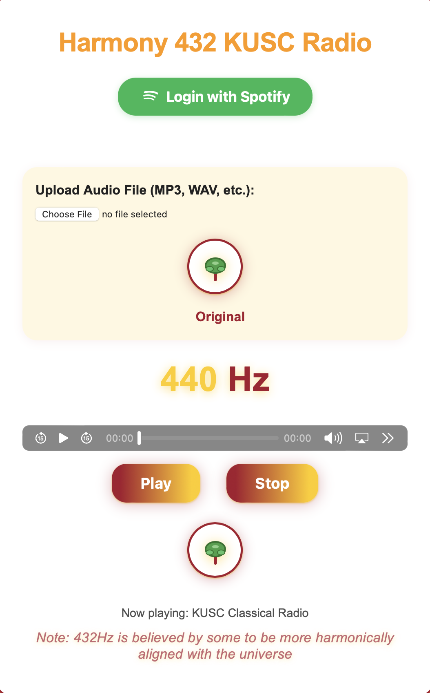

# Harmony 432 KUSC Radio

A web application that streams KUSC Classical Radio and allows you to listen in either the original 440Hz tuning or a 432Hz pitch-shifted version, believed by some to be more harmonically resonant.

## UI Preview


*Modern, USC-themed interface with Spotify login, playlist browsing, 432Hz pitch-shifting, and audio upload features.*

## Installation & Setup

### Prerequisites
- Node.js (v16+ recommended)
- npm (comes with Node.js)

### Install Dependencies
Run this in your project directory:

```sh
npm install express got
```

If you plan to use any other backend features, install additional dependencies as needed.

### Start the App
```sh
npm start
```

The app will run at [http://localhost:3000](http://localhost:3000)

## Features
- **Live KUSC Streaming**: Listen to the official KUSC radio stream directly from your browser.
- **Bit-Perfect 440Hz Playback**: The "Original" mode uses the native HTML5 audio element for truly bit-perfect, unprocessed playback—no resampling, no processing, just the original KUSC stream.
- **432Hz Pitch-Shifted Playback**: The "432Hz" mode uses the Web Audio API to shift all frequencies by 432/440 (≈ 0.9818), with high-quality cubic interpolation.
- **Instant Toggle**: Switch between "Original" (bit-perfect) and "432Hz" (processed) playback instantly using the frequency toggle.
- **Fallback Streams**: Automatically tries alternate KUSC streams if the primary stream is unavailable.

## How It Works
- The app proxies the KUSC stream through a Node.js Express server.
- On the frontend, the audio is played using a custom web player.
- **Original (440Hz) Mode:** Bit-perfect playback is achieved by playing the stream directly with the native HTML5 `<audio>` element—no Web Audio API, no resampling, no processing.
- **432Hz Mode:** When 432Hz is selected, the audio is routed through the Web Audio API and processed in real time using a high-quality pitch-shifting algorithm (cubic interpolation, 432/440 ratio).
- Switching between modes is instant and seamless.

## Getting Started

### Prerequisites
- [Node.js](https://nodejs.org/) (v14 or later recommended)

### Installation
1. Clone this repository:
   ```bash
   git clone <your-repo-url>
   cd kusc-432hz-converter
   ```
2. Install dependencies:
   ```bash
   npm install
   ```

### Running the App
Start the server:
```bash
node server.js
```
Then open your browser and visit [http://localhost:3000](http://localhost:3000)

## File Structure
- `server.js` - Express server that proxies the KUSC radio stream.
- `public/` - Contains the frontend HTML, CSS, and JavaScript.
  - `index.html` - Main web page.
  - `script.js` - Handles audio playback, bit-perfect/original toggle, and pitch conversion.
  - `styles.css` - Application styling.
  - `tone-generator.js` - (Optional) Tone generation utilities.

## Playback Modes
- **Original (440Hz, Bit-Perfect):** The stream is played directly via the browser's audio element, with absolutely no processing or resampling. This ensures true bit-perfect playback.
- **432Hz (Processed):** The stream is routed through the Web Audio API and pitch-shifted in real time using cubic interpolation and a 432/440 ratio.

## The 432Hz Conversion Algorithm
- The core algorithm multiplies all audio frequencies by 432/440 (≈ 0.9818) using the Web Audio API.
- Cubic interpolation is used for high-quality pitch shifting.
- This is the industry-standard method for converting music from 440Hz to 432Hz tuning.

## Credits
- KUSC Classical Radio ([kusc.org](https://www.kusc.org/))
- 432Hz pitch-shifting concept inspired by community tools and open-source projects.

## License
MIT License
